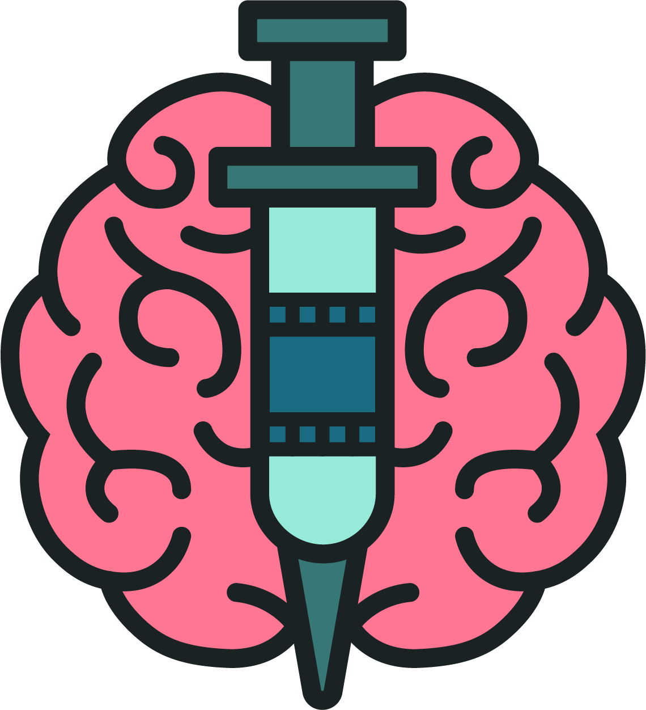

 
   

 

# Dopamine

Dopamine is web application that allows you to track your favorite movies and TV shows.

## Building & Running 🛠️
1. Install Node.js from [here](https://nodejs.org/en/download/).
2. `git clone https://github.com/JakubKonkol/Dopamine.git || cd Dopamine `
3. `npm install`
4. `ng serve --open`
## Credits 🙏
